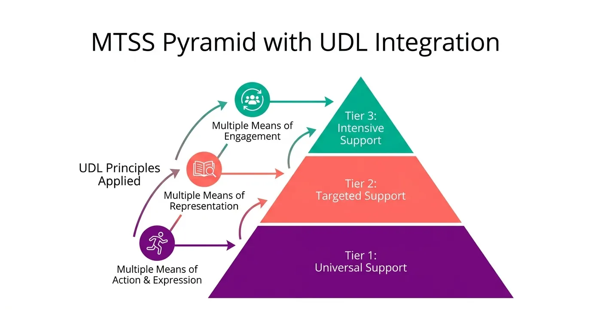
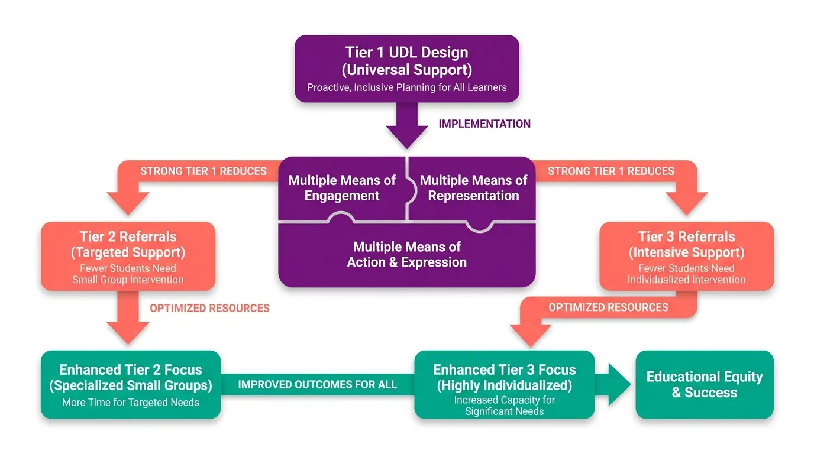
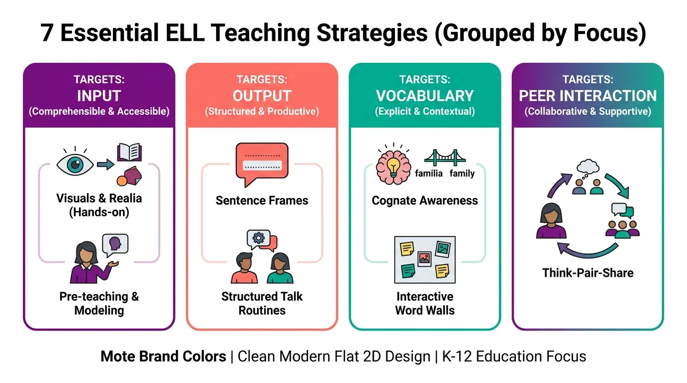

# Diagrams

## Purpose

Diagrams that communicate K-12 / SpEd / accessibility expertise visually.
The test: a teacher looks at this and thinks *"this is useful"* or
*"this makes total sense."* Anything that fails that test isn't a Mote
diagram.

Common diagram types:

- **UDL framework diagrams**: the three UDL principles and their
  relationships.
- **MTSS pyramids**: Tier 1 / 2 / 3 with intervention examples (often
  combined with UDL principles).
- **MTSS / UDL flowcharts**: process diagrams showing how strong Tier 1
  reduces Tier 2 / 3 referrals, etc.
- **IEP / 504 decision trees**: accommodations workflows.
- **Reading process diagrams**: phonemic awareness through comprehension.
- **Strategy menus / card grids**: grouped-by-focus diagrams (e.g.
  "7 Essential ELL Teaching Strategies" grouped by Input / Output /
  Vocabulary / Peer Interaction).
- **Mote feature flows**: how a feature works step by step.
- **Comparison maps**: Mote vs. competitor side-by-side feature spread.
- **Worked examples**: a single concrete scenario applying a framework.

## Subject rules

- **Reference existing K-12 patterns.** Teachers already know the MTSS
  pyramid, the UDL grid, the IEP timeline. Use the patterns they
  recognize as the bones; layer Mote's interpretation on top. Don't
  reinvent the canonical shapes.
- **One core concept per diagram.** A diagram explains one thing well,
  not five things badly.
- **Expert, not basic.** Proper terminology, accurate relationships, no
  oversimplification. Mote diagrams should look like they came from
  someone who actually knows the framework.

## Composition

- **Clear visual hierarchy.** The most important element is biggest /
  brightest / most-central. Secondary elements visually subordinate.
- **Simple shapes**: circles, rectangles, triangles, arrows, puzzle
  pieces (for connected concepts). No 3D, no isometric.
- **Generous negative space.** Don't crowd.
- **Inline labels** close to the things they label. Avoid long legend
  keys.
- **Reading direction follows convention**: pyramids bottom-up, flows
  top-down or left-to-right, card grids left-to-right.

## Color palette (UDL mapping)

**This is where the UDL color mapping lives.** Not in feature icons,
not in concept illustrations.

| UDL principle | Mote color | Hex |
|---|---|---|
| **Engagement** | Mote Purple | `#AC0AE8` |
| **Representation** | Coral | `#F97316` |
| **Action & Expression** | Teal | `#14B8A6` |

For non-UDL diagrams:

- **Default**: Mote Purple as primary, with coral and teal for additional
  states / tiers / categories. Gold for accents and highlights.
- **Card grids**: vary across families for visual variety (same rule as
  concept illustrations: purple / coral / teal / gold).
- **Avoid all-gray**; at least one brand color to mark the diagram as
  Mote's.

## Iconography inside diagram elements

Two patterns recur across Mote diagrams (visible in the reference set):

- **Colored circle with small white icon inside**: used for marking the
  three UDL principles (book / person / running figure inside purple,
  coral, teal circles). Icon is flat, white, geometric, like a feature
  icon but rendered as solid white inside a solid colored bubble rather
  than as duotone.
- **Inline flat-2D iconography inside card-grid cells**: small geometric
  icons (an eye, a sentence-frame, a brain, two students) illustrating
  the strategy or item in each card. Stays flat, minimal, and in the
  card's color family.

## Card-grid layout (grouped-by-focus diagrams)

For diagrams that group multiple items by focus area or category (e.g.
the ELL teaching strategies reference below):

- **N cards laid out in a row.**
- Each card structured as:
  - **Header band** in a brand-color family ("TARGETS: INPUT" in purple
    family, "TARGETS: OUTPUT" in coral family, etc.).
  - **Main label** below the band ("Visuals & Realia (Hands-on)").
  - **Inline iconography** illustrating the items.
  - **Short descriptive labels** for each item.
- **Vary brand color families across cards** for visual variety. Purple
  / coral / teal / gold, or repeat purple at start and end for symmetry
  (as the reference does with 4 cards).

## Typography in image

- **Plus Jakarta Sans** for headings and titles within the diagram.
- **DM Sans** for labels and body text within the diagram.
- **Sentence case** for labels. **Title Case** for proper nouns and
  framework names (UDL, MTSS, IEP, 504).
- **All-caps acceptable** for short header bands inside cards
  (e.g. "TARGETS: INPUT") and short connector labels in flowcharts
  (e.g. "STRONG TIER 1 REDUCES"). Avoid all-caps for body text.

## Style treatment

- **Flat 2D.** No 3D, no isometric, no drop shadows on diagram elements.
  Clarity over depth.
- **Soft rounded corners** on shapes; matches Mote's overall language.
- **Solid fills** for elements (matches the diagram's role as a clear
  explainer; reserves the 2-tone duotone for icons and concept
  illustrations).
- **Arrows are simple**: solid lines or solid arrow shapes with simple
  heads, never decorative. Curved arrows OK to show flow direction.

## Do / don't

**Do**

- A UDL framework diagram with three principles in the matching brand
  colors (purple / coral / teal), each marked by a small white icon in
  a colored circle.
- An MTSS pyramid with UDL principles overlaid via curved arrows,
  using the color mapping throughout.
- A card grid grouped by focus area, with each card in a different
  brand-color family and inline iconography for items.
- Inline labels in DM Sans, headings in Plus Jakarta Sans.

**Don't**

- A 3D / isometric UDL "wheel"; flat 2D only.
- MTSS pyramid in non-Mote colors.
- Reinventing canonical K-12 shapes (don't invent a new MTSS; use
  the one teachers know).
- Decorative complexity that doesn't add meaning.
- Long legend keys when inline labels would work.
- All-caps for body text (header bands and short connector labels are
  the only exceptions).
- **AI-generation artifact captions** baked into the image. Things
  like *"Mote Brand Colors | Clean Modern Flat 2D Design | K-12
  Education Focus"* as a footer line are generator hallucinations and
  must be removed before the diagram ships. The diagram should never
  describe its own design system in-frame.

## Reference images

Three canonical Mote blog diagrams, all from the most-recent
UDL/MTSS/ELL content. The full set lives in
[`./assets/diagram/`](./assets/diagram/):

### MTSS Pyramid with UDL Integration

Three-tier pyramid (purple Tier 1, coral Tier 2, teal Tier 3) with the
three UDL principles in matching color bubbles connected by curved
arrows. Uses the canonical icon-in-circle pattern for the UDL principle
markers.

### Tier 1 UDL Flowchart

Top-down flowchart. Central UDL puzzle piece in Mote Purple, branching
out to coral Tier 2/3 referrals, then to teal "enhanced focus" outcomes
ending in "Educational Equity & Success". Uses all-caps for short
connector labels ("STRONG TIER 1 REDUCES").

### 7 Essential ELL Teaching Strategies (card grid)

Card-grid layout, four cards across, each in a different color family
(purple / coral / teal / purple). Header bands name the target ("TARGETS:
INPUT"), main labels name the strategy, inline iconography illustrates
each strategy item.

> Note: this reference image has an AI-generated footer caption ("Mote
> Brand Colors | Clean Modern Flat 2D Design | K-12 Education Focus")
> that should *not* be reproduced; see the Don't list above.

## How to produce one

Hand-built in Figma is the default. For simple structures, Claude can
output mermaid / SVG that gets rendered and re-styled to brand. Workflow:

1. **Write the brief** in the `body-image-N-description` format above.
2. **Choose the framework.** UDL? MTSS? Reading process? Card grid?
   Use the canonical structure teachers recognize.
3. **Identify the one thing the diagram explains.** Cut anything that
   isn't in service.
4. **Apply UDL color mapping** if relevant; otherwise default to Mote
   Purple primary + other brand families.
5. **Lay out** simple shapes with clear hierarchy and reading direction.
6. **Add iconography** inside colored shapes (small white icons in
   bubbles, or inline flat-2D icons in cards) where it helps the
   diagram read at a glance.
7. **Add inline labels** in Plus Jakarta Sans (headings) / DM Sans
   (body).
8. **Strip any AI-generated artifact captions** before export.
9. **Export** at the size the placement needs (see image-style index).
