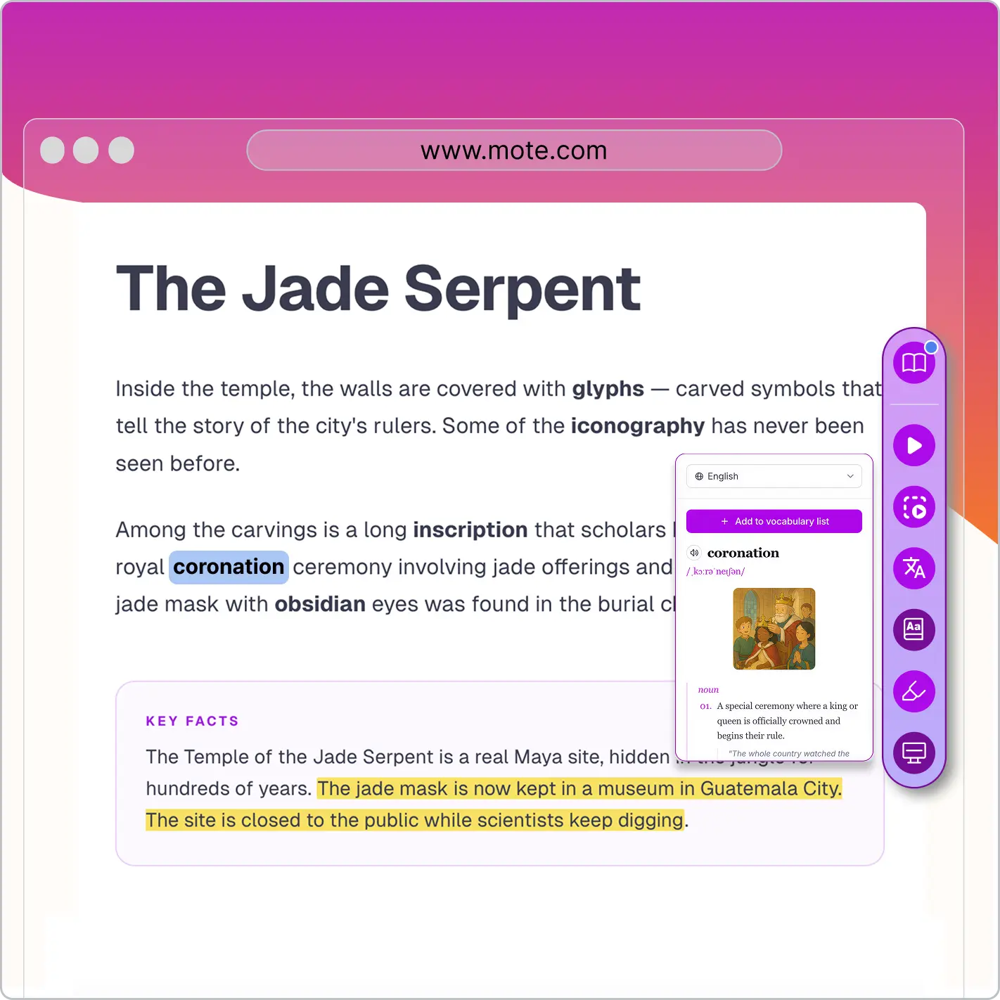
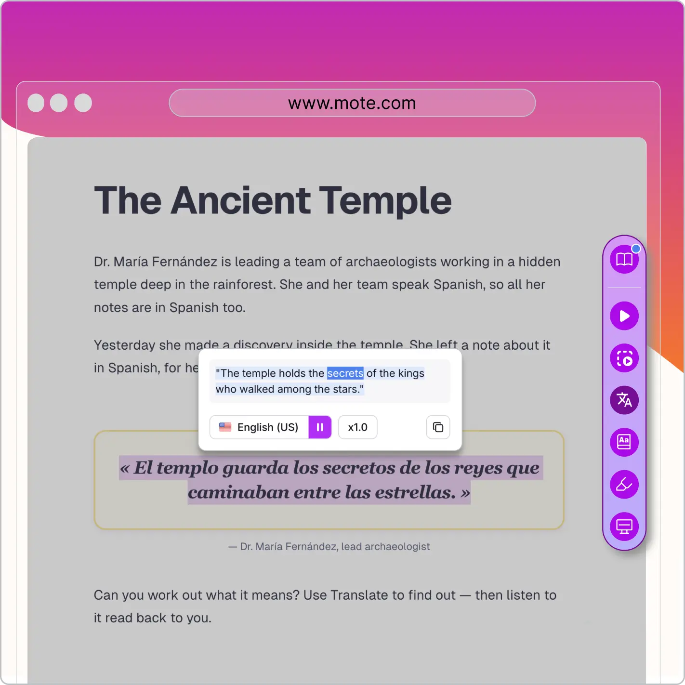
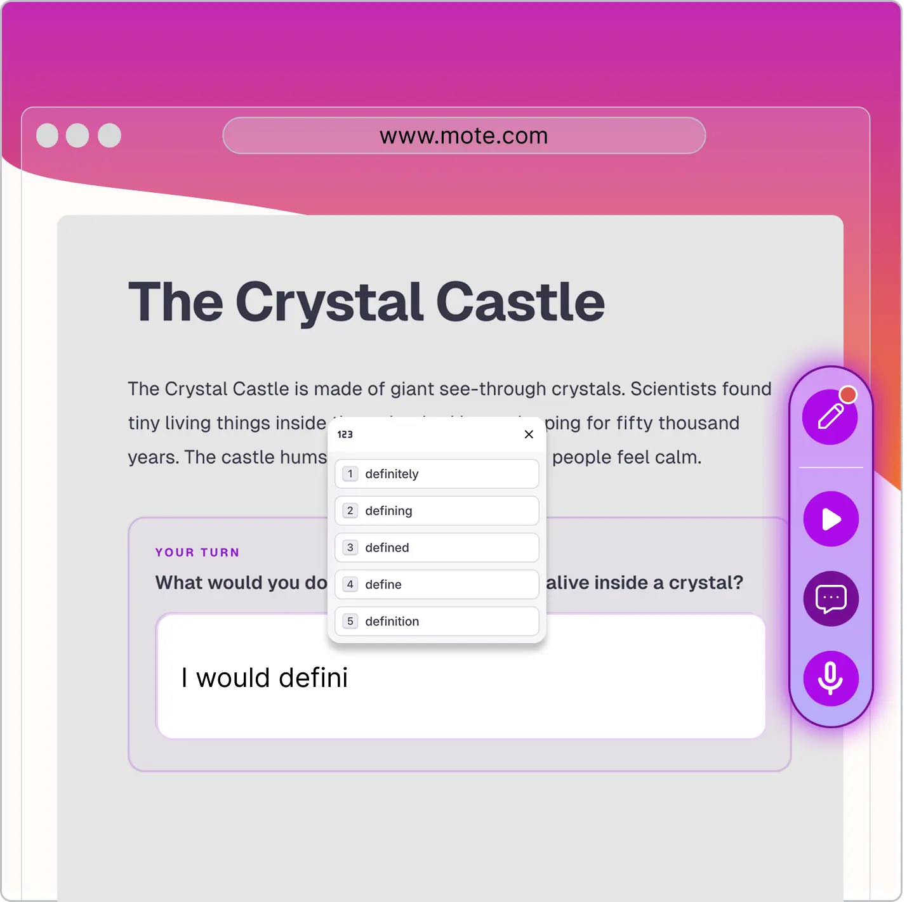

# Product screenshot

## Purpose

Mote UI staged inside a designed, Mote-branded frame. Used wherever the
job is *"this is what Mote actually looks like in use."* Common surfaces:

- **Pillar-page heroes**: the canonical use case; the visible "Mote in
  context" image at the top of every pillar page.
- **Landing-page heroes**: same canonical staging.
- **Use-case key features**: the feature in action.
- **Blog post mid-content**: when prose references a UI element.
- **Social / OG product cards**: for product launches and features.

This style does *not* cover:

- Raw full-bleed screenshots without staging (loose assets, not
  brand-styled images).
- Animated product captures (those live in `whats-new` placements as
  GIFs; same staging applies).

## The canonical staging (five layers)

Used for pillar-page and landing-page heroes. Every full Mote product
screenshot is built on the same five-layer structure (see the three
reference images below):

1. **Mote gradient frame**: rounded-corner outer frame in a **pink →
   coral** gradient covering top and sides, fading lighter toward the
   bottom-right. The brand-marker that distinguishes a Mote product
   screenshot from any other tech company's.
2. **Stylised browser top**: three gray "traffic light" dots top-left +
   a pill-shaped URL bar centered, showing **`www.mote.com`** (always
   Mote's own URL, never docs.google.com or anything else).
3. **Content area**: soft warm-gray background inside the frame, on
   which the article and sidebar sit.
4. **Fake-but-plausible reading content**: a constructed passage with a
   title ("The Jade Serpent", "The Ancient Temple", "The Crystal
   Castle" in the reference set), academic-style prose, and
   highlighting / inline interactions demonstrating the feature.
5. **Mote sidebar**: the **real Mote UI** sidebar floating on the right
   edge of the content area, showing the actual feature icons and any
   open panel (vocabulary card, translation pill, word prediction list,
   etc.) demonstrating the feature.

The Mote sidebar is the only "real product" element; everything else
(article content, words, sentences, attributions) is constructed to fit
the demonstration.

## Simplified treatment for smaller placements

For surfaces where the full branded frame would be too heavy (in-blog
product references, social cards, thumbnails, smaller body images), use
a simplified treatment:

- **Drop the gradient frame and browser top.**
- **Keep the Mote sidebar** + a representative content snippet (smaller
  crop of a fake article, or just the panel that's in use).
- **Place on a warm-white field** (`#FFFBF7` or `#FEF7F0`).
- **Add a soft Mote-family blob** behind for brand-colored staging
  (purple, gold, or teal).
- **Apply `shadow-soft-md`** for depth.

The full canonical staging is reserved for pillar-page and landing-page
heroes; the surfaces where the brand-frame treatment earns its weight.

## Subject rules

- **Real Mote UI elements only.** Real sidebar, real feature icons, real
  open panels. Captured from the live product. No fake mockups of the
  sidebar; no invented UI elements; no Figma stand-ins.
- **Fake-but-plausible reading content.** Sample passages, titles, and
  highlighted phrases are constructed for the demonstration. They must
  read as plausible academic-style content. *"The Jade Serpent"*
  works; lorem ipsum doesn't.
- **No personally identifying information.** No real student names, real
  teacher names, or real document IDs. Constructed bylines (e.g. *"Dr.
  María Fernández"*) and constructed topics only.
- **Capture the moment that proves the point.** If the page is about
  Translation, show the Translation panel mid-use. If it's about
  Vocabulary, show a vocabulary card open.

## Color palette

- **Gradient frame** (canonical staging): pink → coral. Saturated at the
  top/sides, lighter at the bottom-right corner. Echoes the Mote Purple
  ↔ Coral brand gradient direction.
- **Background** (simplified staging): warm-white (`#FFFBF7`) or warm-alt
  (`#FEF7F0`).
- **Content area**: warm-gray (`#F5F5F4`-ish, soft and neutral so the
  sidebar reads cleanly against it).
- **Sidebar**: real product colors (Mote Purple icons on a white sidebar
  background).
- **In-content interactions** (highlights, underlines, word-prediction
  popovers): pulled from the actual in-product colors (purple
  highlights, light-purple boxes, light-yellow for the highlighter
  feature).

## Typography in image

- **Page title** inside the fake article: Plus Jakarta Sans display
  weight, black.
- **Body text** inside the fake article: humanist sans that reads as a
  generic web article.
- **URL bar**: clean sans-serif, centered, `www.mote.com`.
- **Inside Mote sidebar panels**: real Mote UI typography (DM Sans).

## Depth

- **Canonical staging**: soft purple-tinted shadow under the whole framed
  composition.
- **Simplified staging**: `shadow-soft-md` under the sidebar.
- **No drop shadow on the sidebar itself in canonical staging**; it
  floats clean against the content area inside the frame.

## Callouts

**Mote does not use callout pointers on product screenshots.** The
sidebar's position on the right edge, the highlighting inside the
content, and the open panel showing the feature are enough to
demonstrate the use case. Don't add arc arrows or annotation labels.

## Do / don't

**Do**

- Mote-branded pink → coral gradient outer frame with stylised browser
  top and `www.mote.com` URL (for hero placements).
- Real Mote sidebar pasted onto a constructed reading passage that
  demonstrates the feature.
- Plausibly-fake reading content with a constructed title and bylined
  attribution.
- Highlighting and interaction states shown using the real in-product
  colors.
- Simplified sidebar-on-warm-white + soft blob for smaller placements.

**Don't**

- Vanilla Chrome browser chrome (must be the Mote-branded frame for
  hero placements).
- `docs.google.com` URL or any URL other than `www.mote.com`.
- Lorem ipsum or "Test User 123" in the reading content.
- Real student names, real teacher names, or real document content
  (constructed only).
- Fake Mote sidebar or invented UI elements (real sidebar only).
- Chromebook bezel, phone frame, or any non-Mote-frame device chrome.
- Callout pointers, arc arrows, or annotation labels.
- Background that competes with the frame; the frame *is* the
  brand-marker.
- Anything overlapping the Mote lockup (when the lockup is in the
  composition).

## Reference images

Three canonical pillar-page heroes, all using the full five-layer staging:

### UDL Pillar hero

Demonstrates the Vocabulary / Multilingual Dictionary feature. Shows the
sidebar with the vocabulary card open and a highlighted word in the
article.

### English Learner Pillar hero

Demonstrates the Translation / Read Aloud features for English Language
Learners. English passage at the top with a Spanish translation quoted
underneath, and a translation playback pill open.

### MTSS Pillar hero

Demonstrates the Word Prediction feature for students who need writing
support. Word-prediction popover with numbered suggestions above a "Your
Turn" student input field.

## How to produce one

Composed in Figma (or equivalent). Workflow for the canonical staging:

1. **Capture** the relevant Mote sidebar / panel from the live product.
2. **Construct** a plausible reading passage (title + 2-3 paragraphs of
   academic-style prose).
3. **Compose** the five layers in Figma:
   1. Gradient frame (pink → coral) with rounded outer corners.
   2. Browser top with traffic-light dots + `www.mote.com` URL pill.
   3. Warm-gray content area inside the frame.
   4. Fake article (title + body + any highlights / interactions in
      product colors).
   5. Real Mote sidebar pasted onto the right edge.
4. **Demonstrate the feature** with the relevant open panel or
   interaction state.
5. **Export** at the size the placement needs (see image-style index).

For the simplified staging: skip steps 3.1 and 3.2 (frame and browser
top); use warm-white background + soft blob + shadow-soft-md.

## How to brief this image type

> Mote product screenshot, **[pillar-page-hero / simplified]** style: real
> Mote sidebar demonstrating **[FEATURE]** with **[panel / interaction
> state]**, pasted onto a constructed reading passage titled
> **"[plausible title]"** about **[plausible subject]**. *[Pillar-hero
> only: framed in the canonical Mote pink → coral gradient frame with
> stylised browser top and `www.mote.com` URL.]* *[Simplified only:
> warm-white background with soft [color family] blob behind,
> `shadow-soft-md`.]* Aspect ratio **[16:9 / 4:3 / etc.]**. No PII;
> plausible reading content; no callouts.

## Notes / open items

- **Bottom edge of the frame**: in the references, the bottom edge is
  open / unbordered (frame wraps top + sides only). Confirm this is the
  consistent rule.
- **Simplified-staging references**: none in `./assets/` yet; pull 1-2
  examples from in-blog product references to anchor the simplified
  pattern.
