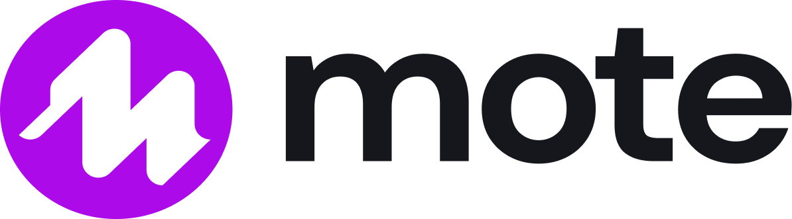

# Visual Identity

Mote's visual foundations. Use this for any visual output: Webflow pages,
landing pages, hero images, slide decks, social cards, blog headers, AI-generated
imagery, and any design Claude is asked to produce.

## Visual style stance

Mote's visual identity should match its voice: **trustworthy, human, smart
colleague, never generic.** In practice:

- **Photography for human moments.** Real people, real classrooms, real
  settings; documentary in feel, not staged stock. Use for heroes, lifestyle
  marketing, case studies, anywhere a person carries the message.
- **Two-tone iconography for icons, always Mote Purple.** Clean,
  geometric, professional, two-tone (light purple fill `#F8E5FF` +
  Mote-Purple stroke `#AC0AE8` + Mote-Purple internal accents). Consistent
  across the whole icon set as a brand marker. Not character illustration.
  Not "happy cartoon laptop with a smile." Spec + canonical reference:
  [`image-style/feature-icon.md`](./image-style/feature-icon.md).
- **Concept illustration uses the same 2-tone construction at larger scale,
  with varied palette.** Single object, 2-tone within one Mote brand-color
  family per illustration (purple / coral / teal / gold), no scene, no
  people. Palette varies across a set for visual variety; there is no
  semantic color rule (the UDL color mapping is a diagram thing, not an
  illustration thing). Used for landing-page benefit grids, pillar-page
  solution cards, one-pagers. Spec + reference set:
  [`image-style/concept-illustration.md`](./image-style/concept-illustration.md).
- **Clear K-12 diagrams for explainers.** Diagrams that communicate expert
  knowledge of the area. The test is whether a teacher looks at it and
  thinks *"this is useful"* or *"this makes total sense."* Reference existing
  patterns (assessment loops, MTSS pyramids, UDL guidelines, IEP/504 decision
  trees) and put a Mote spin on them. Brand colors, simple shapes, clear
  hierarchy. **UDL color mapping lives here** (Engagement = purple,
  Representation = coral, Action & Expression = teal); not in feature icons,
  not in concept illustrations.
- **Product UI on staged backgrounds.** Mote's own interface, framed
  honestly, composed on a designed background: soft brand-colored backdrop,
  gentle blob, drop shadow, optional frame device (browser chrome, Chromebook
  bezel, callout pointer). The pillar pages set the current template;
  consistent treatment specified in
  [`image-style/product-screenshot.md`](./image-style/product-screenshot.md).

The principle: **avoid generic, avoid cartoonish, avoid anything that could
have come from any other ed-tech brand.** Specificity is what makes the image
feel like Mote.

Per-image-type guidance (subject, composition, palette, prompts) lives in
[`image-style/`](./image-style/_index.md).

## Color palette

Mote's design system is structured around named color **families**. Each
family has a full **50-950 scale** for accents, hover states, gradients, and
shading. The headline values below are the **primary use** of each family; the
full scales live in Figma; refer there for exact hex on every stop.

### Brand

| Family | Primary | CSS variable | Usage |
|---|---|---|---|
| **Mote Purple** | `#AC0AE8` | `--mote-purple` | Primary brand color. Buttons, links, key UI accents. |
| **Mote Purple Light** | `#F8E5FF` | `--mote-purple-light` | Light purple backgrounds, blob gradients. |

### Neutral

| Family | Primary | CSS variable | Usage |
|---|---|---|---|
| **Text Primary** | `#111827` | `--text-primary` | Headings, primary text. |
| **Text Secondary** | `#6B7280` | `--text-secondary` | Subtitles, descriptions. |
| **Text Muted** | `#636363` | `--text-muted` | Labels, metadata. WCAG AA compliant. |
| **Surface Warm** | `#FFFBF7` | `--surface-warm` | Default page background. |
| **Surface Warm Alt** | `#FEF7F0` | `--surface-warm-alt` | Card backgrounds, alternating sections. |

The Neutral family also carries a full Gray scale (50-950) for borders,
dividers, and subtle backgrounds.

### Accent

| Family | Primary | CSS variable | Usage |
|---|---|---|---|
| **Coral** | `#F97316` | `--accent-coral` | Secondary accent, gradient text highlights. |
| **Teal** | `#14B8A6` | `--accent-teal` | Tertiary accent, benefit icons. |
| **Gold** | `#FBBF24` | `--accent-gold` | Quaternary accent, benefit icons. |

### Messaging (UI status states)

| Family | Use | CSS variable |
|---|---|---|
| **Blue** | Informational messages | `--messaging-blue` |
| **Green** | Success states | `--messaging-green` |
| **Orange** | Warning states | `--messaging-orange` |
| **Red** | Error states | `--messaging-red` |

These have full 50-950 scales like the other families. Use **only** for UI
status messaging, not for general accent or decoration. The Accent family
above carries that role.

## UDL category color mapping

The UDL principles map to Mote's brand colors. Use consistently in UDL
diagrams, infographics, and pillar pages.

| UDL principle | Color | Hex |
|---|---|---|
| **Engagement** | Mote Purple | `#AC0AE8` |
| **Representation** | Coral | `#F97316` |
| **Action & Expression** | Teal | `#14B8A6` |

## Typography

| Usage | Font | Weights | CSS family |
|---|---|---|---|
| Display / Headings (h1-h4) | Plus Jakarta Sans | 500, 600, 700, 800 | `'Plus Jakarta Sans', system-ui, sans-serif` |
| Body / labels | DM Sans | 400, 500, 600 | `'DM Sans', system-ui, sans-serif` |

Headings use weight 700, letter-spacing −0.02em. Hero h1 is responsive:
`clamp(2.25rem, 6vw, 3.75rem)` (36-60px).

## Shadows

Soft shadows with a subtle purple tint to maintain brand consistency. Three
sizes:

- **shadow-soft-sm**: badges, small cards
- **shadow-soft-md**: cards, hover states
- **shadow-soft-lg**: elevated cards, modals

Each combines a neutral dark drop with a low-opacity Mote-Purple drop. See the
Style Guide PDF or `CLAUDE.md` for full CSS values.

## Animations & easing

**Principle: smooth and subtle. Never bouncy spring animations.**

Easing functions:

- `--ease-spring` (primary, smooth deceleration): `cubic-bezier(0.22, 1, 0.36, 1)`
- `--ease-out-expo`: `cubic-bezier(0.19, 1, 0.22, 1)`

Standard keyframes:

- **slideUp**: titles and content entering from below
- **slideDown**: badges and elements entering from above
- **fadeInUp**: cards and staggered content
- **float**: decorative background blobs (slow, infinite)

Pattern: stagger entry animations with `.animation-delay-100 / 200 / 300 / 400 /
500` for a cinematic load.

Three rules worth calling out:

- Hover lifts are subtle (`translateY(-4px)` only); **not bouncy**.
- Thumbnail zooms are subtle (`scale(1.03)`); **not aggressive**.
- Icon scales are subtle (`scale(1.05)`); **no rotation**.

## Decorative background blobs

Mote's visual signature in hero sections: soft, blurred gradient blobs floating
slowly in the background. Three color variants: purple, gold, teal. Each blob
is large (250-400px), absolute-positioned, blurred (80px), 50% opacity, and
animates with the `float` keyframe.

Pattern: a hero typically uses 2-3 blobs at staggered animation delays.

## Components

Component CSS lives in the Webflow site code and the Mote Webflow Style Guide
PDF. This file summarizes what exists; refer to those for full CSS.

- **Buttons**: three variants: `btn-mote` (primary, Mote Purple solid),
  `btn-mote-outline` (Mote Purple border), `btn-mote-white` (white, for
  colored backgrounds). **Always solid color. Never gradient backgrounds.**
  Pill-shaped (`border-radius: 9999px`), DM Sans 600 / 15px.
- **Cards**: `.card` for product / course cards (rounded 20px, Surface Warm Alt
  background, subtle hover lift); `.benefit-card` (white, rounded 24px, centered
  text, icon container).
- **Benefit icon container**: 72px square, rounded 20px, with three gradient
  variants (purple, teal, gold) using brand colors.
- **Hero section**: predictable structure: blobs + badge + h1 (often with
  gradient text on a highlighted phrase) + subtitle. See the Hero Section
  Pattern in the Style Guide PDF.
- **Badge** (`.hero-badge`): pill-shaped, white background, Mote Purple text,
  DM Sans 600 / 14px.
- **Gradient text**: used on highlighted hero phrases.
  `linear-gradient(135deg, #AC0AE8, #F97316)`, clipped to text.

## Logo

Mote's lockup combines the "M" icon with the wordmark. Three lockup
variants plus a standalone M mark for design use:

### Primary (for light backgrounds)

- File: `assets/mote-lockup-dark.png`
- Canonical: `https://media.mote.com/marketing/brand-assets/mote-lockup-dark.png`
- When to use: warm-white, white, or light backgrounds. Default choice.

### Light / mid variant

- File: `assets/mote-lockup-light.png`
- Canonical: `https://media.mote.com/marketing/brand-assets/mote-lockup-light.png`
- When to use: medium-tone backgrounds where the primary lockup loses contrast.

### White / inverted (for dark backgrounds)

- File: `assets/mote-lockup-white.png`
- Canonical: `https://media.mote.com/marketing/brand-assets/mote-lockup-white.png`
- When to use: dark backgrounds (dark purple, dark gray, photography).

### M mark (standalone, design use, not branding)

- File: `assets/mote-mark.png`
- When to use: as a **decorative or compositional element inside an
  image**: a small mark on a hero illustration, an accent inside a
  marketing graphic, a sticker-style placement on a piece of design
  work. **Not for branding.** The full lockup is the default for any
  Mote-facing brand signature. If in doubt, use the lockup.

**Layering rule (applies to all variants):** the Mote logo (lockup or
M mark) always sits on the **top layer** of a composition. Nothing
crosses over the logo.

Detailed logo usage rules (clear space, minimum size, on-light vs on-dark, "do
not" examples) live in [`image-style/logo-usage.md`](./image-style/logo-usage.md).

## Where things live canonically

**For Claude generating visual content** (slide decks, landing-page mocks,
social cards, AI image prompts): start with the **visual style stance** above,
then apply the color palette, typography, shadow principles, animation
principles, and logo. For per-image-type guidance, route to
[`image-style/`](./image-style/_index.md).

## How to use this file

- **Designers and writers**: pick colors, fonts, and the right logo variant
  from here; honor the visual style stance.
- **Engineers**: refer to `CLAUDE.md` for tokens and component code.
- **Claude generating visuals**: start with the visual style stance, then
  apply the foundations. For per-image-type guidance, route to
  [`image-style/`](./image-style/_index.md).
- **UDL-themed assets**: use the UDL principle mapping so colors stay
  consistent across diagrams, pillar pages, and slide decks.
